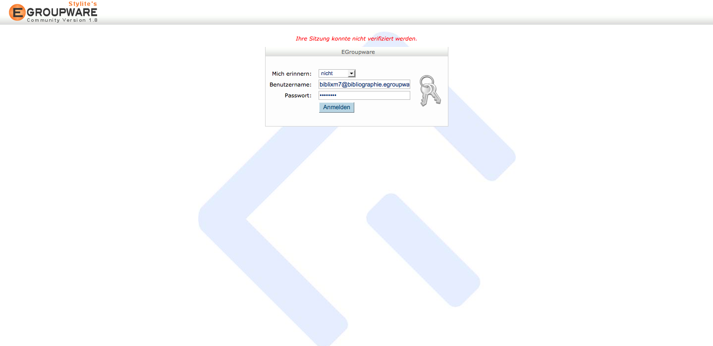
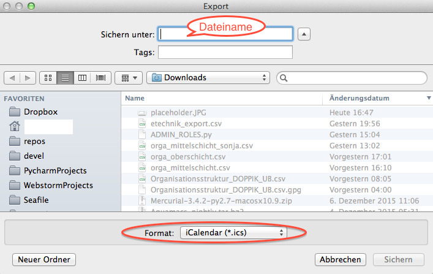
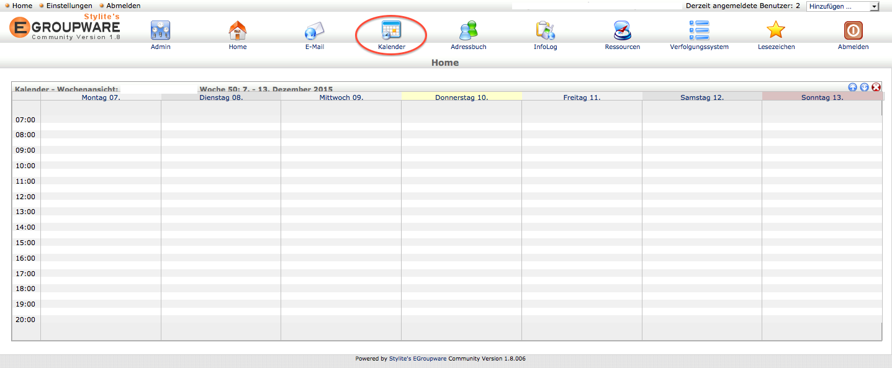

---
title: 'Thunderbird/Lightning mit eGroupware verwenden'
author:
 - name: André Hagenbruch
date: 2015-12-10
...
[Übersicht](/)

#Thunderbird + Lightning mit eGroupware verwenden
0. Unter [http://egroupware.ruhr-uni-bochum.de/](http://egroupware.ruhr-uni-bochum.de/) finden sich detailierte Informationen zu eGroupware. Zunächst muss man für ein **Funktionskonto** einen Kalender beantragen, der dann innerhalb einiger Tage von IT.Services angelegt wird. Im Laufe dieses Prozesses bekommt man zwei Mails: In der ersten wird man darüber informiert, dass ein eGroupware-Konto eingerichtet wurde, in der zweiten folgt dann die eigentlich wichtige Information, dass der Kalender angelegt wurde.

1. Mit den Anmeldedaten des Funktionskontos an der mitgeteilten URL (in diesem Fall [https://bibliographie.egroupware.rub.de](https://bibliographie.egroupware.rub.de)) anmelden.

2. Auf "Admin" klicken, dann sieht man links neben "Offizielle EGroupware Nutzungsstatistik" einen blauen Punkt, auf den man klickt.

3. Auf "Benutzerkonten" klicken.

4. Auf "Hinzufügen" klicken, um einen neuen Benutzer anzulegen.

5. Login und Passwort vom eigenen RZ-Konto eintragen und die Haken wie unten gezeigt setzen. Zuletzt "Hinzufügen" klicken.

**Hinweis**: *Sollte der neue Benutzer danach nicht in der Übersicht auftauchen, muss man auf den Anfangsbuchstaben des Login-Namens in der Kopfzeile der Tabelle klicken*.

6. In Thunderbird einen neuen Kalender im Netzwerk anlegen mit Protokoll "CalDAV" und der URL https://bibliographie.egroupware.rub.de/groupdav.php/**rzlogin**/calendar, wobei **rzlogin** durch den eigenen Anmeldenamen beim Rechenzentrum ersetzt werden muss.

7. Alten Kalender exportieren.

8. Im nachfolgenden Dialog als Exportformat "iCalendar (*.ics)" auswählen.

9. Aus eGroupware abmelden und mit dem eigenen Anmeldedaten wieder anmelden. Dann auf "Kalender" klicken.

10. In der linken Spalte beim Punkt "Importieren: iCal & CSV" auf iCal klicken.

 
11. Im folgenden Dialog die vorher gespeicherte Datei auswählen.

12. Optional kann man nun noch anderen Gruppenmitgliedern Zugriff auf den eigenen Kalender gewähren.

13. Dies sollte man für den Bereich "Lesen" auch tun, um Terminabsprachen zu erleichtern.

