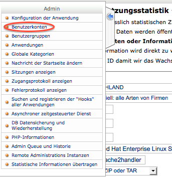
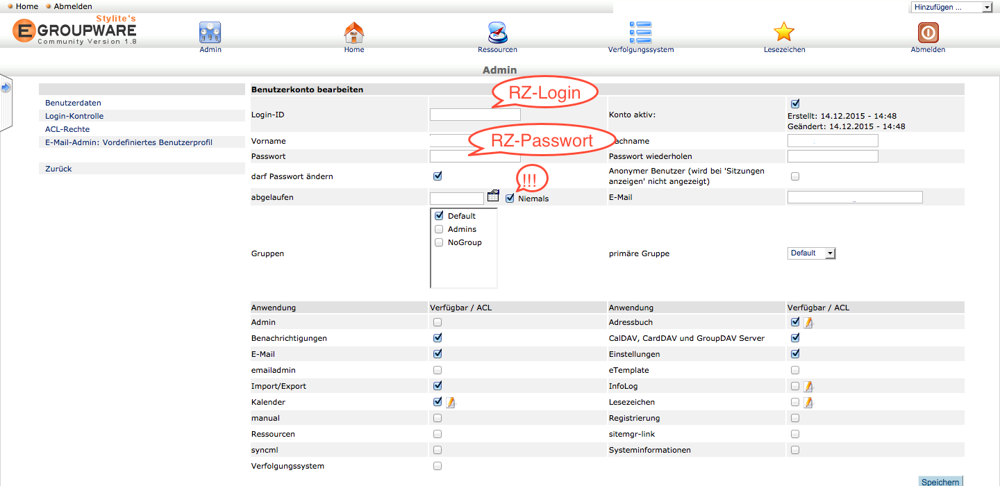
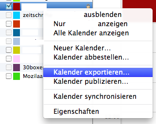
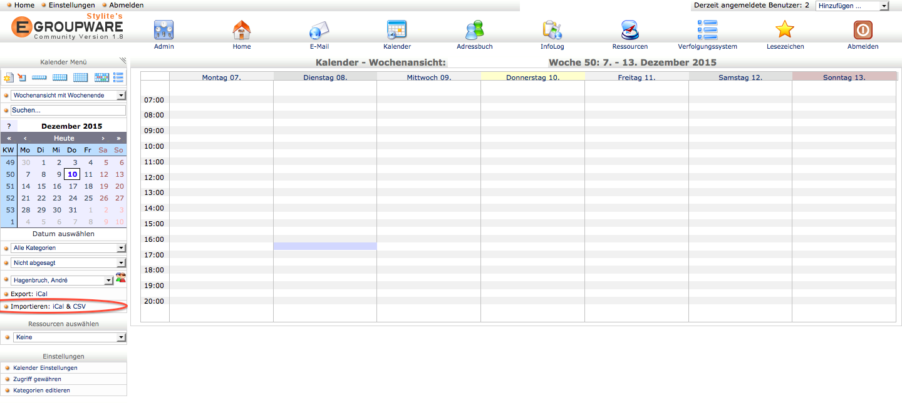

---
title: 'Thunderbird/Lightning mit eGroupware verwenden'
author:
 - name: André Hagenbruch
date: 2015-12-10
...

#Thunderbird + Lightning mit eGroupware verwenden
1. Mit dem biblixm7-Passwort bei [https://bibliographie.egroupware.rub.de](https://bibliographie.egroupware.rub.de) anmelden.

2. Auf "Admin" klicken, dann sieht man links neben "Offizielle EGroupware Nutzungsstatistik" einen blauen Punkt, auf den man klickt.

3. Auf "Benutzerkonten" klicken.

4. Auf "Hinzufügen" klicken, um einen neuen Benutzer anzulegen.

5. Login und Passwort vom RZ-Konto eintragen und die Haken wie unten gezeigt setzen. Zuletzt "Hinzufügen" klicken.

6. In Thunderbird einen neuen Kalender im Netzwerk anlegen mit Protokoll "CalDAV" und der URL https://bibliographie.egroupware.rub.de/groupdav.php/**rzlogin**/calendar, wobei "rzlogin" durch das entsprechende Login beim Rechenzentrum ersetzt werden muss.

7. Alten Kalender exportieren.

8. Im nachfolgenden Dialog als Exportformat "iCalendar (*.ics)" auswählen.

9. Aus eGroupware abmelden und mit dem eigenen Anmeldedaten wieder anmelden. Dann auf "Kalender" klicken.

10. In der linken Spalte beim Punkt "Importieren: iCal & CSV" auf iCal klicken.

 
11. Im folgenden Dialog die vorher gespeicherte Datei auswählen.

12. Optional kann man nun noch anderen Gruppenmitgliedern Zugriff auf den eigenen Kalender gewähren.

13. Dies sollte man für den Bereich "frei / belegt" auch tun, damit man beim Verschicken von Einladungen sofort sieht, ob jemand zu diesem Zeitpunkt verfügbar ist.

