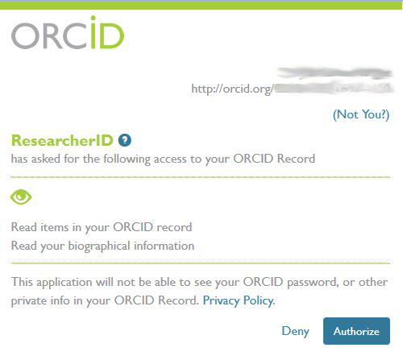
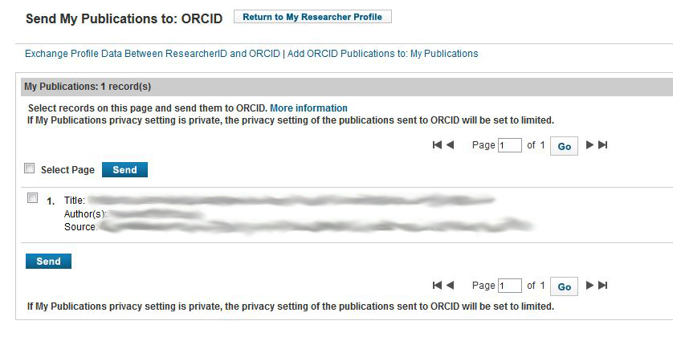
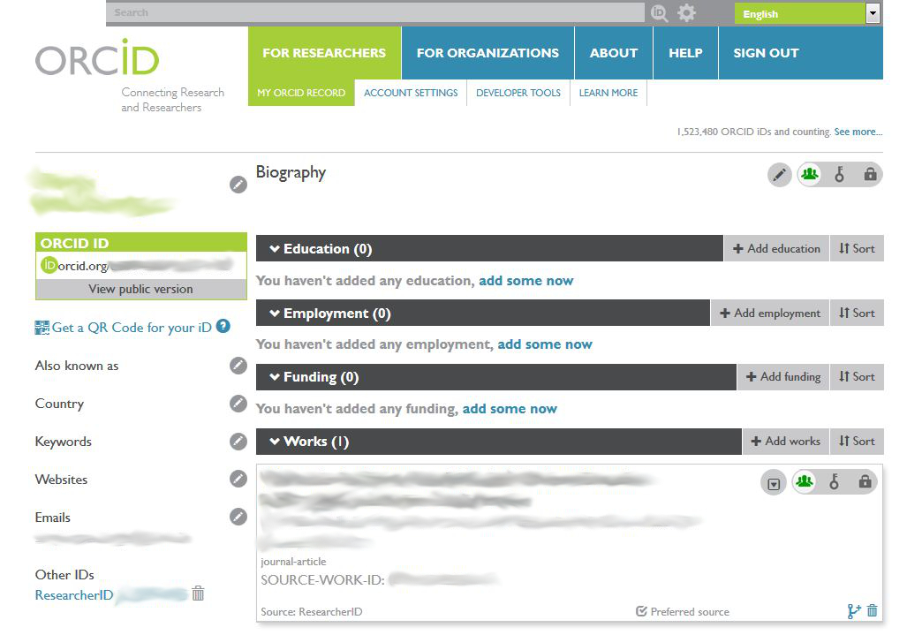

---
title: 'Manual zur ORCID-Registrierung'
author:
 - name: André Hagenbruch
 - name: Veronika Josenhans
date: 2015-08-20
...

#Manual zur ORCID-Registrierung

Die ORCID (Open Researcher and Contributor ID) ist eine international anerkannte Kennung zur eindeutigen Identifikation wissenschaftlicher Autorinnen und Autoren. Anhand dieser Kennung lassen sich einerseits Ergebnisse wissenschaftlicher Arbeit verwalten, andererseits unterstützt sie den administrativen Workflow in der Kommunikation mit Verlagen oder der Universitätsverwaltung. 

###Schritt 1
Prüfen Sie über die Suche von [http://orcid.org/](http://orcid.org/), ob Sie bereits eine ORCID-ID haben. Suchen Sie dazu nach Ihrem Namen. **Bitte legen Sie keine zweite ID an!**

###Schritt 2
Melden Sie sich unter [https://orcid.org/register](https://orcid.org/register) an. In Ihrem Profil können Sie nun Informationen über Ihre Ausbildung, Ihre Beschäftigungsverhältnisse, geförderte Projekte und Ihre Publikationen eingeben. Darüber hinaus ist es möglich, Angaben zu Geburtsnamen, Schlagwörtern, die Ihren Forschungsbereich beschreiben, und Websites, auf denen Informationen zu Ihnen zu finden sind, zu machen. Für jede Angabe außer Ihrem Namen und der ID selbst (beide sind immer öffentlich) können Sie in Ihrem ORCID-Profil die Sichtbarkeit festlegen (everyone, trusted parties, only me). Je mehr Angaben Sie in Ihrem Profil öffentlich hinterlegen, desto aussagekräftiger wird es. Ihr Profil können Sie jederzeit erweitern und aktualisieren.

**Zu Ihrer Namensangabe**

   * Tragen Sie in die Felder "First Name" und "Last Name" Ihren kompletten Namen in der gebräuchlichen Schreibweise ein (mit Umlauten, "ß" und Akzenten etc.).
   * Im wiederholbaren Feld "Also known as" sollten Sie dann gegebenenfalls weitere Schreibweisen notieren (Umlaute ausgeschrieben und auf den Grundbuchstaben reduziert, "ss" statt "ß", Künstlername, Geburtsname etc.)

**Für Ihre Zuordnung zur RUB wichtig:**

   * Bitte geben Sie für Ihre Beschäftigungsverhältnisse an der RUB im Feld "Institution/employer" jeweils den Eintrag "Ruhr-Universität Bochum Bochum (Nordrhein-Westfalen), academic" aus der hinterlegten Liste an. 
   * Im Feld "Department" tragen Sie bitte den Lehrstuhl oder das "Institute of Development Research and Development Policy" oder weitere Organisationseinheiten der RUB ein.

###Schritt 3
Erfassen Sie in Ihrem Profil Ihre gesamten Publikationen. Dafür stehen Ihnen drei Wege zur Verfügung

   * Search & link: Nach Ihrer Zustimmung (authorize) werden verschiedene Datenquellen nach Ihren Publikationen durchsucht
   * Import BibTeX: Hochladen der Publikationsdaten im BibTeX-Format. Für Ihre Publikationen, die bereits in der Hochschulbibliographie verzeichnet sind, können wir Ihnen hierfür eine BibTeX-Datei zur Verfügung stellen.
   *  Add manually: Manuelle Eingabe der Angaben zur Publikation

###Schritt 4
Bitte senden Sie Ihre ORCID-ID an das Team Hochschulbibliographie: [bibliographie-ub@rub.de](mailto:bibliographie-ub@rub.de)

Das Team Hochschulbibliographie pflegt Ihre fehlenden Publikationen in die Hochschulbibliographie ein und kontaktiert Sie im Anschluss daran bzgl. der Einrichtung Ihrer persönlichen Publikationsliste auf den von Ihnen gewünschten Webseiten.
Weitere Informationen zu diesem Dienst bietet vorab: [http://bibliographie-trac.ub.rub.de/wiki/Publikationslisten](http://bibliographie-trac.ub.rub.de/wiki/Publikationslisten)

###Schritt 5
Kommunizieren Sie in Ihren wissenschaftsbezogenen Aktivitäten Ihre ORCID-ID, z.B. bei Publikationen und Förderanträgen, bei Vorträgen und auf Powerpoint-Präsentationen, in Ihrer Mailkorrespondenz etc. Auf diese Weise ist Ihr gesamtes wissenschaftliches Arbeiten stets eineindeutig Ihrer Person zugeordnet.

Bei Fragen, können Sie sich jederzeit an das Team Hochschulbibliographie wenden:

* per Mail an [bibliographie-ub@rub.de](mailto:bibliographie-ub@rub.de)
* telefonisch über die Durchwahl -28560 (Veronika Josenhans), -29346 (Andre Hagenbruch)

##Weitere Schritte: Verknüpfung mit anderen Kennungen
Zur Erhöhung Ihrer Sichtbarkeit in Datenquellen wie [Web of Knowledge](http://webofknowledge.com/), [SCOPUS](http://www.scopus.com/) oder [Google Scholar](https://scholar.google.de/) lohnt es sich, die ORCID ID mit diesen Kennungen zu verknüpfen.

###ResearcherID mit ORCID-ID verknüpfen
Wenn Sie bereits eine [ResearcherID](http://www.researcherid.com/) besitzen, können Sie diese unter "Manage my Profile" mit Ihrer ORCID-ID verknüpfen. Wählen Sie dazu "I already have an ORCID record" und klicken dann auf "Continue":

Im nächsten Schritt können Sie nun Profil- und Publikationsdaten zwischen diesen beiden Quellen austauschen:

Wählt man den Punkt "Profile Data", fragt ORCID im nächsten Schritt, ob man der Anwendung "ResearcherID" die Übernahme der Profildaten erlauben will:

Danach lässt sich dann auswählen, ob man Profildaten von ResearcherID nach ORCID oder umgekehrt austauschen will:

Auch hier wird man zunächst gefragt, ob man dies zulassen will:

Genauso lassen sich auch Publikationsdaten austauschen:

Zunächst wird wiederum gefragt, ob man den Import von Daten aus ResearcherID nach ORCID erlauben will:

Im Ergebnis wird diese Publikation dann in ORCID verzeichnet:

###SCOPUS Author Identifier mit ORCID-ID verknüpfen
TODO: Da die RUB die Datenquelle SCOPUS nicht lizensiert hat, verweisen wir zunächst nur auf die allgemeine Dokumentation zu dieser Kennung: [http://help.scopus.com/Content/h_autsrch_intro.htm](http://help.scopus.com/Content/h_autsrch_intro.htm)

###Google Scholar Identifier mit ORCID-ID verknüpfen
TODO: Zur Zeit lässt sich der [Google Scholar Identifier](https://scholar.google.nl/citations?hl=en) nur als Website angeben. Wenn Sie ihr Google Scholar-Profil auf "public" gesetzt haben, können Sie die entsprechende URL unter "Websites" hinzufügen.